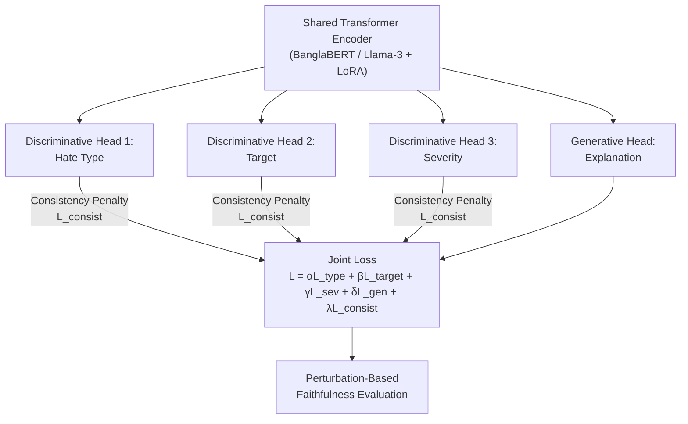

# Novelty & Scope Analysis: Consistency-Constrained Multi-Task Bengali Hate Speech Detection

## Paper at a Glance

| Aspect | Detail |
|:---|:---|
| **Title** | Consistency-Constrained Multi-Task Bengali Hate Speech Detection with Faithfulness-Evaluated Generative Explanations |
| **Target Venue** | ICCIT 2025 (IEEE) |
| **Authors** | Angkon Roy, Nahid Gazi (SUST) |
| **Core Claim** | First Bengali MTL framework with (1) consistency-enforced predictions and (2) faithfulness-verified generative explanations |

---

## 1. Novelty Assessment

### 1.1 Claimed Contributions vs. Prior Art

#### Contribution 1: Consistency Penalty Loss

| Your Claim | What Already Exists | Novelty Verdict |
|:---|:---|:---|
| First consistency penalty for Bengali MTL hate speech | Cross-task consistency learning exists in NLP (Flanigan et al., 2021), vision-language (Zhao et al., 2023), and bridging resolution (Liu et al., 2022). **No published work applies this specifically to Bengali hate speech MTL.** | ✅ **Novel in the Bengali hate speech domain** |

> [!TIP]
> **Strength**: The BLP-2025 shared task systems (Code_Gen, HateSense, PerceptionLab, etc.) all use independent classification heads without any inter-task consistency mechanism. Your work directly addresses a *documented* failure mode of these state-of-the-art systems. This is a genuine, well-motivated contribution.

> [!WARNING]
> **Risk**: The *technique itself* (compatibility-matrix penalty between task heads) is well-established in broader MTL literature. Reviewers may argue this is **application of known method to new domain** rather than **fundamental novelty**. You must clearly frame this as a domain-first contribution, not a general ML contribution.

---

#### Contribution 2: Silver-Standard Rationalization (Dataset Bridging)

| Your Claim | What Already Exists | Novelty Verdict |
|:---|:---|:---|
| Use LLM (Gemini) to generate synthetic explanations for BanglaMultiHate | BanHADEX (Raquib et al., ACL 2026) already uses explanation-guided LoRA and has 19,203 annotated samples with human explanations. X-MuTeST (AAAI 2026) uses LLaMA-3.1 for LLM-consulted explanations in Hindi/Telugu. | ⚠️ **Partially novel — the bridging step is new, but synthetic explanation generation is increasingly common** |

> [!IMPORTANT]
> **Critical Concern**: BanHADEX already has **7 fine-grained hate categories AND 7 target groups AND human explanations**. Your paper claims BanHADEX "lacks the detailed categorical labels" — but it actually has fine-grained hate categories and target groups. The taxonomic misalignment you describe may be overstated. You need to explicitly specify *what exact labels* BanHADEX is missing that BanglaMultiHate has (likely the 3-level severity annotation and the specific BLP-2025 taxonomy). If this difference is not substantial, the rationale for the bridging step weakens.

---

#### Contribution 3: First Faithfulness Evaluation for Bengali Generative Hate Speech

| Your Claim | What Already Exists | Novelty Verdict |
|:---|:---|:---|
| First application of Comprehensiveness, Sufficiency, AOPC to Bengali | X-MuTeST (AAAI 2026) applies comprehensiveness/sufficiency to Hindi + Telugu. BanHADEX (ACL 2026) evaluates explanation quality but via *classification accuracy improvement*, not ERASER-style perturbation metrics. DeepHateExplainer used LRP for Bengali but no faithfulness testing. | ✅ **Novel for Bengali** |

> [!TIP]
> **Strength**: This is arguably your **strongest novelty claim**. Nobody has done perturbation-based faithfulness evaluation on Bengali generative hate speech models. X-MuTeST stops at Hindi/Telugu. BanHADEX tests explanation utility (does it help classification?) but not explanation faithfulness (does it reflect internal reasoning?). You directly fill this gap.

---

### 1.2 Novelty Summary Scorecard

| Contribution | Domain Novelty | Methodological Novelty | Risk Level |
|:---|:---|:---|:---|
| Consistency Penalty Loss | ✅ First for Bengali hate speech | ⚠️ Established technique applied to new domain | Medium |
| Silver-Standard Rationalization | ⚠️ Incremental over BanHADEX/X-MuTeST | ⚠️ LLM-generated explanations are common | High |
| Faithfulness Evaluation (ERASER metrics for Bengali) | ✅ First for Bengali | ✅ First perturbation-based evaluation for this language | Low |

---

## 2. Scope of the Research Topic

### 2.1 What the Paper Currently Covers

### 2.2 Scope Is Appropriate for ICCIT

| Scope Dimension | Assessment |
|:---|:---|
| **Problem Definition** | Well-scoped: two specific gaps (consistency + faithfulness) |
| **Datasets** | Uses two publicly available datasets (BanglaMultiHate ~50K, BanHADEX ~19K) |
| **Methods** | Joint MTL + consistency penalty + generative head + ERASER metrics |
| **Target Venue** | ICCIT 2025 — this is a good fit (regional IEEE conference, Bengali NLP focus) |

> [!NOTE]
> The scope is **ambitious but appropriate** for a conference paper. However, the paper currently has **no experimental results, no tables, no figures, and no ablation studies**. The manuscript as written is a 4-page framework proposal, not a complete research paper. For ICCIT acceptance, you will need all of these.

### 2.3 Scope Gaps & Missing Sections

| Missing Element | Criticality | Notes |
|:---|:---|:---|
| **Experiments & Results** | 🔴 Critical | No baselines, no F1/accuracy tables, no comparison with Code_Gen/HateSense |
| **Ablation Study** | 🔴 Critical | Must show: (a) model without L_consist, (b) model without generative head, (c) full model |
| **Consistency Violation Rate** | 🔴 Critical | You claim models contradict themselves — quantify it! Show % of contradictory predictions in baselines vs. your model |
| **Faithfulness Results** | 🔴 Critical | Comprehensiveness/Sufficiency/AOPC scores must be reported |
| **Figures** | 🟡 Important | Architecture diagram, confusion matrices, perturbation curves |
| **Hyperparameter Details** | 🟡 Important | Values of α, β, γ, δ, λ; training details |
| **Ethical Considerations** | 🟡 Important | Using LLM-generated "silver-standard" data raises quality/bias concerns |
| **Limitations Section** | 🟡 Important | Standard requirement for any venue |
| **Reproducibility** | 🟢 Nice-to-have | Code/data availability statement |

---

## 3. Critical Issues to Address

### 3.1 The BanHADEX Overlap Problem

> [!CAUTION]
> **Your biggest vulnerability**: BanHADEX (ACL 2026) already provides human-annotated explanations for Bengali hate speech WITH fine-grained categories AND target groups. Your paper positions itself as if no explanations exist for labeled Bengali data — but BanHADEX does provide them.
>
> **What you must do**: Clearly articulate what *specific* taxonomic mismatch exists between BanglaMultiHate's labels and BanHADEX's labels. If BanglaMultiHate has a severity scale that BanHADEX lacks, say so explicitly and argue why severity-conditioned explanations are necessary.

### 3.2 The "Silver-Standard" Quality Question

> [!WARNING]
> Using Gemini to generate synthetic explanations and then testing faithfulness on those same synthetic explanations creates a **circular reasoning risk**. You're training on machine-generated explanations and then testing if the model faithfully reproduces machine-generated reasoning. Reviewers will ask: "Faithful to what? To another LLM's hallucination?"
>
> **Mitigation**: Include a human evaluation component where annotators assess a sample of silver-standard explanations for correctness.

### 3.3 Missing Formal Definition of Consistency Penalty

The paper mentions the compatibility matrix penalty "scales exponentially" for contradictory predictions, but does not provide the actual mathematical formulation of $\mathcal{L}_{consist}$. For example:
- How is the contradiction matrix $\mathbf{C}$ defined?
- What specific label pairs are considered contradictory?
- Is it a soft or hard constraint?

---

## 4. Competitive Landscape (Who You Must Beat/Compare Against)

| System | Venue | What They Do | How You Differ |
|:---|:---|:---|:---|
| **Code_Gen** | BLP-2025 (Winner) | BanglaBERT + MuRIL ensemble, adversarial contrastive training | No consistency, no explainability |
| **HateSense** | BLP-2025 | Focal Loss + ORPO | No consistency, no explainability |
| **BanHADEX** | ACL 2026 | Human explanations + explanation-guided LoRA | No consistency constraint, no perturbation-based faithfulness |
| **X-MuTeST** | AAAI 2026 | Faithfulness evaluation for Hindi/Telugu | Doesn't cover Bengali |
| **DeepHateExplainer** | IEEE DSAA 2021 | LRP-based token highlighting for Bengali | Post-hoc only, no generative explanations, no faithfulness |

> [!TIP]
> **Your unique position**: You are the only work that combines consistency constraints + generative explanations + faithfulness evaluation in a single Bengali framework. This intersection is genuinely unoccupied.

---

## 5. Overall Verdict

### Strengths
1. **Well-motivated problem**: The consistency gap in BLP-2025 systems is a real, documented issue
2. **Genuine first for Bengali**: Perturbation-based faithfulness evaluation hasn't been done for Bengali
3. **Good dataset strategy**: Combining BanglaMultiHate + BanHADEX is practical and realistic
4. **Appropriate venue**: ICCIT is a good match for this contribution level

### Weaknesses
1. **No experimental results**: The paper is currently a framework/proposal without validation
2. **BanHADEX overlap is underaddressed**: The taxonomic mismatch claim needs precise justification
3. **Silver-standard circularity**: Training on LLM-generated explanations and testing faithfulness on them
4. **Consistency penalty not formally defined**: $\mathcal{L}_{consist}$ needs a full equation
5. **Incremental flavor**: Each individual technique exists; the novelty is in their *combination for Bengali*

### Recommendation

> [!IMPORTANT]
> **The research topic is sound and publishable at ICCIT**, but the paper needs substantial additional work:
> 1. Run experiments and report results with baselines
> 2. Formally define the consistency penalty with full equations
> 3. Precisely articulate the BanglaMultiHate ↔ BanHADEX taxonomy gap
> 4. Report consistency violation rates (before vs. after your penalty)
> 5. Report Comprehensiveness/Sufficiency/AOPC scores
> 6. Include a small human evaluation of silver-standard explanation quality
